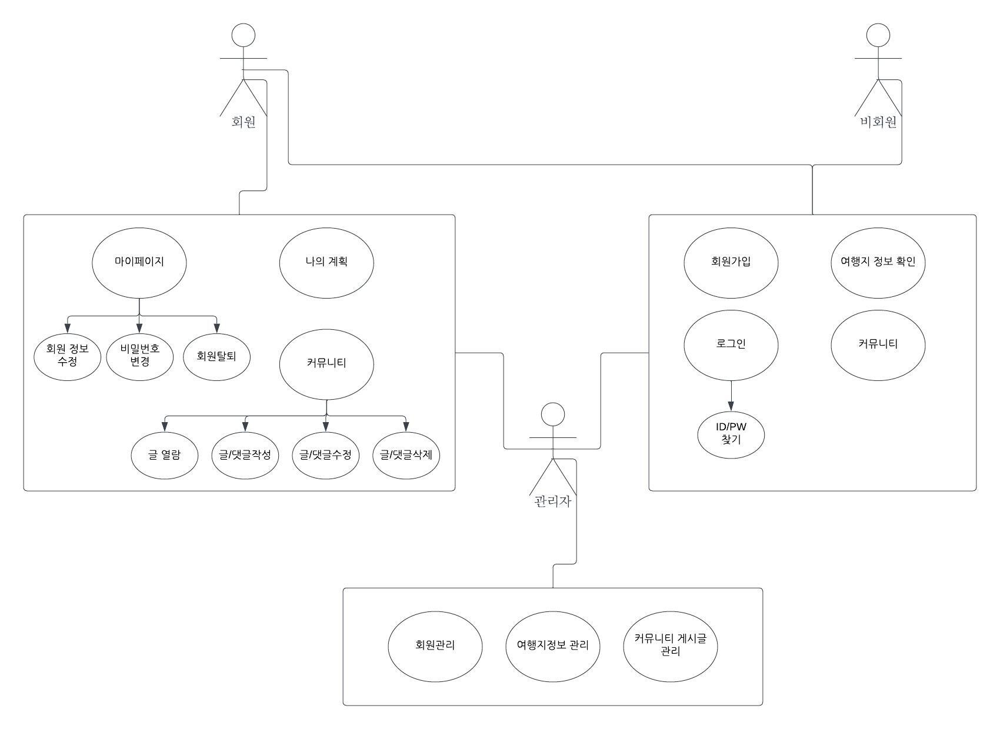
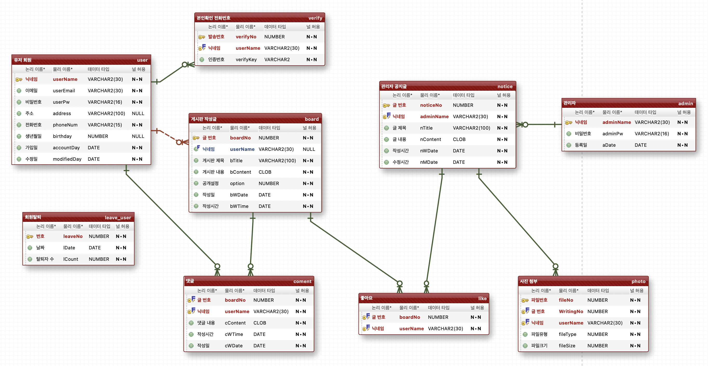
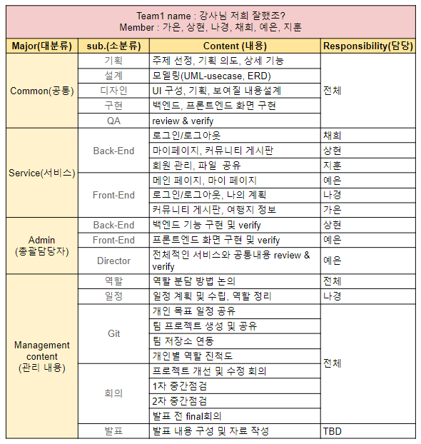

# 2.회의록

유형: 짧은 회의
회의 날짜: 2023년 11월 14일 17:30

- **목차**
    
    

**회의 안건**

<aside>
💡 평가자 체크 리스트 작성

</aside>

**참석자**

<aside>
👥 박채희, 서지훈, 이가은, 이나경, 이상현, 임예은

</aside>

# 📋 회의록

### 회의 내용

---

- 요구사항 확인 : 평가자 체크 리스트
    
    현재 프로젝트 진행 중인 사이트의 아래 항목에 대해 상세하게 명시하세요.
    
    ---
    
    1. 프로젝트 주제 및 기획의도 
        - 주제
            
            (세계)여행 정보 제공 웹사이트
            
            → 이 사이트는 전 세계 여행에 관한 다양한 정보를 한 곳에 모으고, 여행을 즐기는 사용자들에게 유용한 리소스를 제공하는데 중점을 두고 있습니다.
            
        - 기획 의도
            1. **정보 통합 및 간편한 접근**
                
                여행자들이 여행 정보를 찾기 위해 다양한 카페와 웹사이트를 돌아다니는 번거로움을 겪지 않도록 저희 사이트에서는 여행 관련 정보를 체계적으로 정리하여 쉽게 찾을 수 있도록 합니다.
                
            2. **개인 여행 기록 및 공유**
                
                사용자들은 자신의 여행 일정, 사진, 일기 등을 사이트에 기록하고 다른 여행자들과 공유할 수 있습니다. 이를 통해 개인적인 여행 경험을 기록하고, 여행 공유 커뮤니티에 참여할 수 있습니다.
                
            3. **사용자 커뮤니티 및 팁 공유**
                
                여행을 사랑하는 사용자들은 우리의 커뮤니티에서 소통하고 다양한 여행 팁을 공유할 수 있습니다. 이를 통해 지식을 교환하고 다른 여행자들과 연결할 수 있습니다.
                
    
    ---
    
    1. 전체 유스케이스(use-case) 다이어그램 (이미지) 
        
        [https://lucid.app/lucidchart/02da1d94-771c-47b2-82f9-4c7725be08aa/edit?invitationId=inv_7b1596b1-2df2-47c2-9044-42782fc7aa4b](https://lucid.app/lucidchart/02da1d94-771c-47b2-82f9-4c7725be08aa/edit?invitationId=inv_7b1596b1-2df2-47c2-9044-42782fc7aa4b)
        
        
        
    
    ---
    
    1. 전체 ERD (이미지) 
        
        
        
    
    ---
    
    1. 자신이 맡은 기능 및 설명 
        
        [https://docs.google.com/file/d/1Q8FxmPSgdRUzuAKhiMXnVpZa5zavKZwp/edit?usp=docslist_api&filetype=msexcel](https://docs.google.com/file/d/1Q8FxmPSgdRUzuAKhiMXnVpZa5zavKZwp/edit?usp=docslist_api&filetype=msexcel)
        
        
        

### 결정사항

---

- 회의 내용과 같음

### 향후 일정

---

- 백엔드 기능, 프론트엔드 화면 구현

### 특이사항

---

없음