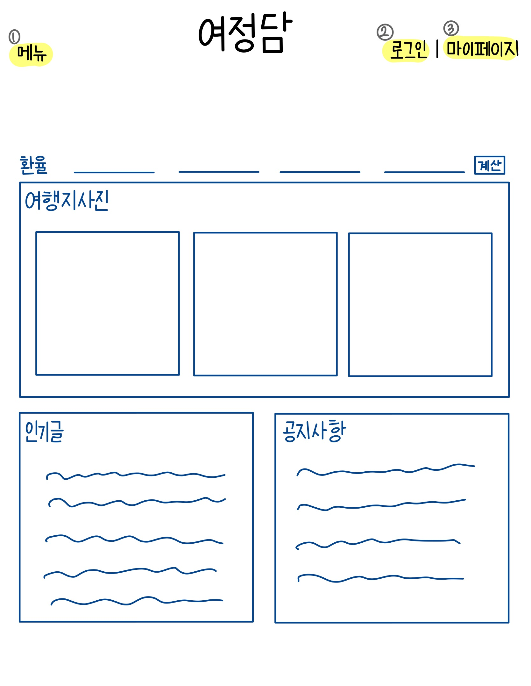

# 4.회의록

유형: 팀 주간 회의
회의 날짜: 2023년 11월 27일 18:30

- **목차**
    
    

**회의 안건**

<aside>
💡 역할 분담 / 기능 정하기

</aside>

**참석자**

<aside>
👥 박채희, 서지훈, 이가은, 이나경, 이상현, 임예은

</aside>

# 📋 회의록

### 회의 내용

---

- 페이지 별 기능 구현
    - ⌜메인페이지⌟
        
        
        
        ① 메뉴 
        
        여행지 {국내 / 해외 / 숙소&교통}
        
        커뮤니티 {여행후기 / 동행자 찾기 / 나의 계획 / Q&A / 공지사항}
        
        ABOUT (=여정담 홈페이지 소개글)
        
        ② 로그인
        
        회원가입
        
        SNS 계정 연동 (간편 회원가입)
        
        아이디 / 비밀번호 찾기
        
        ③ 마이페이지
        
        회원정보 수정 및 회원 탈퇴
        
        내가 쓴 글
        
        찜한 목록
        
        To Do List (여행 준비물)
        
    - ⌜국내 / 해외 - 메인페이지⌟
        
        ① 지역선택 폼
        
        ② 요즘 많이 찾는 지역
        
        지역 사진 클릭 → 상세 정보 페이지로 이동
        
        ③ 지금 인기 있는 공간
        
        슬라이드 사진 (찜만 가능) 
        
        최대 업로드 5장, 최대 글자 수 100자 
        
        사진 클릭 시 → 커뮤니티로 이동
        
        ④ 다가오는 전시, 행사 일정
        
        달력 형식 
        
        해당 날짜 클릭 → 행사 내용(사진, 행사이름, 행사기간, 행사위치) 표시
        
    - ⌜국내 - 상세페이지⌟
        
        ① 해당 지역 사진 
        
        ② 해당 지역 설명 
        
        특산물, 지역 소개글 등
        
        ③ 해당 지역 인기 명소
        
    - ⌜해외 - 상세페이지⌟
        
        ① 해당 나라 사진 
        
        ② 해당 나라 설명 
        
        전압, 유심, 와이파이 정보 등
        
        ③ 해당 나라 인기 명소
        
        ④ 해당 나라 출입국 신고서 작성방법 & 비자 정보
        
        ⑤ 월 별 날씨
        
        ⑥ 환율 정보 & 계산기
        
        ⑦ 영사관(대사관) 전화번호
        
    - ⌜국내 / 해외 - 숙소&교통 페이지⌟
        
        ① 숙소 (국내 + 해외)
        
        호텔스닷컴, 여기어때 등 아이콘 클릭 → 숙소 홈페이지로 이동
        
        ② 교통 (국내)
        
        기차, 비행기, 시내/외버스, 택시, 렌트카 등 아이콘 클릭 → 관련 홈페이지로 이동
        
        ③ 교통 (해외)
        
        비행기 예약 사이트 등 아이콘 클릭 → 관련 홈페이지(티켓 예약 발권 페이지)로 이동
        
    - ⌜커뮤니티 페이지⌟
        
        ① 여행 후기 + 인기 장소 업로드
        
        가입된 회원만 업로드 가능
        
        인기 장소 업로드의 경우, 인스타 스토리와 같은 형식
        
        여행 후기 업로드의 경우, 블로그 형식으로 구성
        
        ② 동행자 찾기
        
        가입된 회원만 업로드 가능
        
        ③ 나의 계획
        
        가입된 회원만 업로드 가능
        
        ④ Q&A
        
        ⑤ 공지사항 
        
        관리자만 업로드 가능
        

---

- 팀명 투표
    - 후보
        
        ① 강사님 저희 잘했조 ?
        
        ② 여정담 (여행 정보를 담아)
        
        ③ 만반우일 (만나서 반갑습니다 우리는 1팀입니다)
        
        ④ 당산동 육쪽이 (DANGYUK)
        
        ⑤ 당장. (당신의 장소를 확인하세요)
        
        ⑥ 상예나가지채
        
        ⑦ 1조
        
    
    ∴ 결정 : ② 여정담 (여행 정보를 담아) 
    
    → 삼행시 같은 경우는 추후에 다시 고민해보기 !
    

### 결정사항

---

- 역할 분담 완료
    
    가은, 채희 - 메인페이지, 마이페이지, 로그인페이지
    
    예은, 나경 - 여행지 페이지 (국내, 해외)
    
    상현, 지훈 - 커뮤니티 (게시판, 나의 계획, 동행자 찾기 등)
    
- 페이지 별 기능 구성 완료
- 팀명 선택 완료 → 여정담 (여행 정보를 담아)

### 향후 일정

---

- 각자 맡은 부분 디자인 초안 구성
- html + css (디자인) 시작

### 특이사항

---

없음