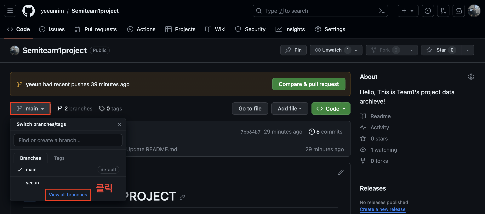
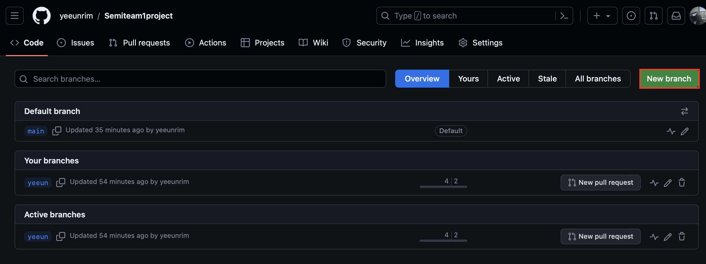
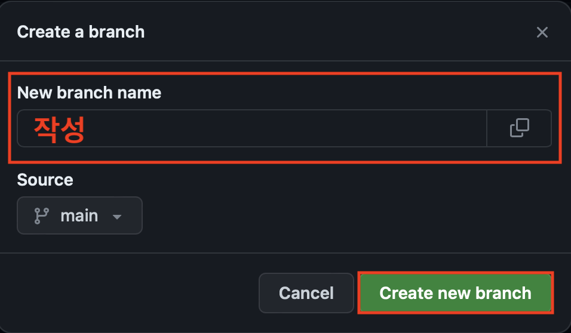

# Github

유형: 기타

**Create Team Github**

<aside>
💡 팀 프로젝트에 사용한 Github repositories 생성

</aside>

# ⚒️ 업로드 방법

### Branch 생성

---

1. main → view all branches : 클릭

1. New branch : 클릭

1. New branch name  : 각자 사용한 이름 작성 → Create new branch

### Terminal & 명령 프롬포트 사용

---

> 참고 사이트
> 
> 
> [https://skmouse.tistory.com/entry/Github-branch생성-후-push하기](https://skmouse.tistory.com/entry/Github-branch%EC%83%9D%EC%84%B1-%ED%9B%84-push%ED%95%98%EA%B8%B0)
> 
>  [https://velog.io/@kyumin__/Git-팀-프로젝트-환경-구성-2.-팀원들마다-branch-생성해서-작업하기](https://velog.io/@kyumin__/Git-%ED%8C%80-%ED%94%84%EB%A1%9C%EC%A0%9D%ED%8A%B8-%ED%99%98%EA%B2%BD-%EA%B5%AC%EC%84%B1-2.-%ED%8C%80%EC%9B%90%EB%93%A4%EB%A7%88%EB%8B%A4-branch-%EC%83%9D%EC%84%B1%ED%95%B4%EC%84%9C-%EC%9E%91%EC%97%85%ED%95%98%EA%B8%B0)
> 

1. 각자의 파일(폴더) 생성
2. git init
3. git remote add origin https://github.com/yeeunrim/Semiteam1project.git
4. git pull origin main
5. git checkout 브랜치이름  → 본인이 생성한 브랜치이름
6. git add .
7. git commit -m “어쩌구”
8. git push origin 브랜치이름 → 본인이 생성한 브랜치이름